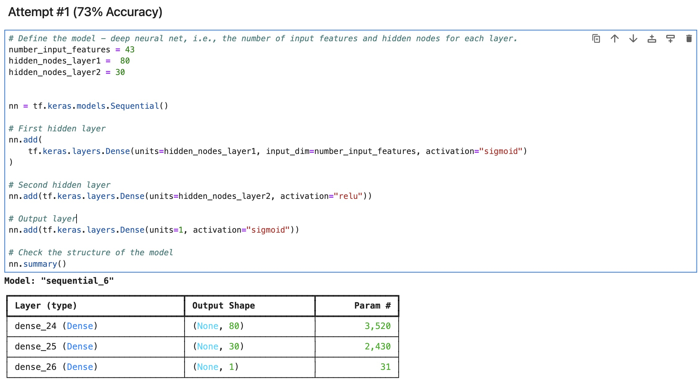
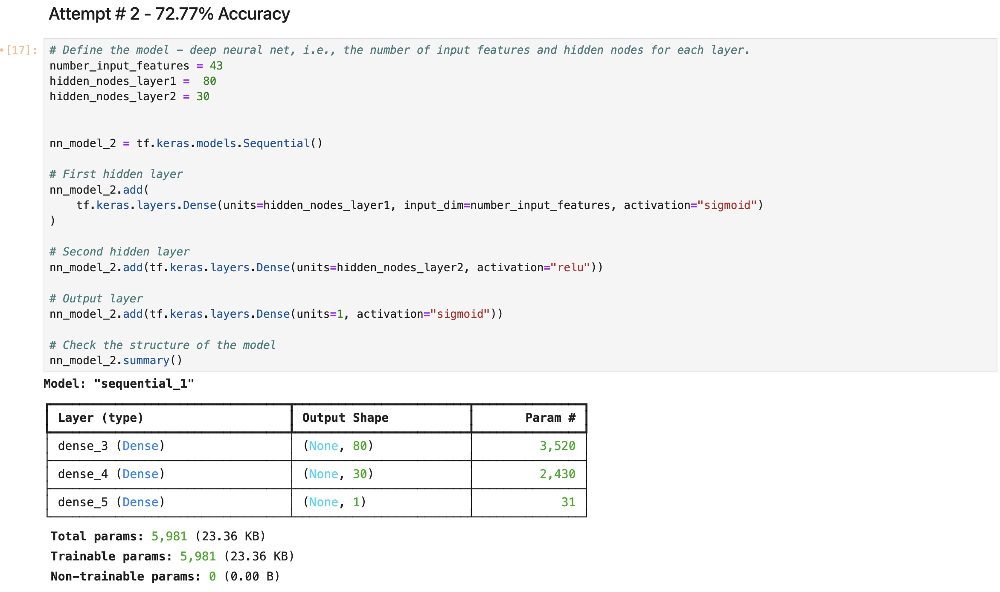
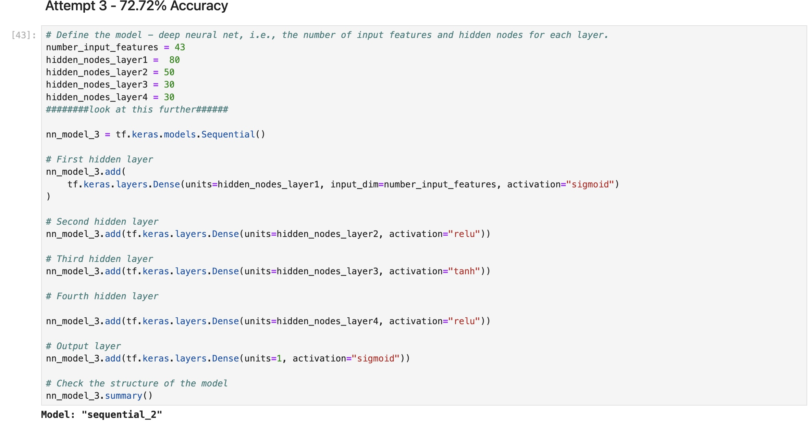
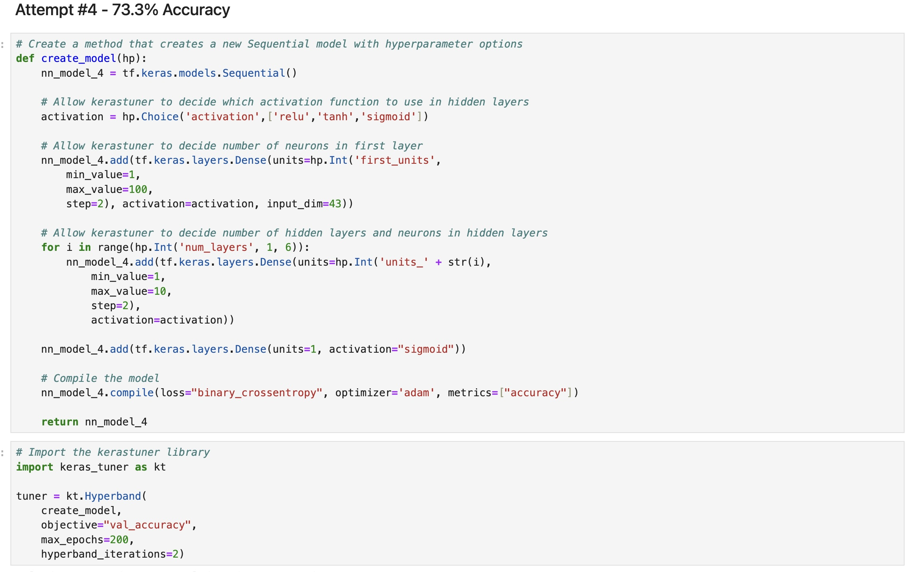

# Deep Learning Challange

## Overview of the Analysis

## Introduction

A nonprofit foundation named "Alphabet Soup" is looking to machine learning as a means to create a model that will help them identify which organizations they can donate to with the stated goal of achiveing a 75% success rate, or in machine learning terms, 75% accuracy. In this exercise I've created 4 different machine learning models to attempt to achieve that goal. 

#### What variable(s) are the target(s) for your model?
* Information on all past organizations Alphabet Soup invested in was provided via a web link csv and converted into a pandas dataframe. The 'IS_SUCCESSFUL' column from application_df is the target variable, this is a binary yes or no showing whether or not the project was successful.

* #### What variable(s) are the features for your model?
* The feature variables used are:
  1. AFFILIATION — Affiliated sector of industry
  2. CLASSIFICATION — Government organization classification
  3. USE_CASE — Use case for funding
  4. ORGANIZATION — Organization type
  5. STATUS — Active status
  6. INCOME_AMT — Income classification
  7. SPECIAL_CONSIDERATIONS — Special considerations for application
  8. ASK_AMT — Funding amount requested
 
#### What variable(s) should be removed from the input data because they are neither targets nor features?
* Identification columns: The "EIN" and "NAME" columns are identification columns that provide unique identifiers for each organization. These columns have no direct impact on the target variables and can be dropped without affecting the model's accuracy.

### Compiling, Training, and Evaluating the Model

#### How many neurons, layers, and activation functions did you select for your neural network model, and why?
#### Attempt #1 (73% Accuracy)

* In the first neural network model, two-layer hidden layers were used with 80 and 30 neurons used in the first and second layer, respectively. There were 43 input values and this seemed like a good starting point with a sufficient number of neurons to handle the amount of inputs. The first layer utilizing a sigmoid activation function and the second using a relu activation. The output layer had a single neuron and sigmoid activation function to map the output to a range between 0 and 1, representing either a successful or unsuccessful outcome. This attempt was run with 200 epochs, the choice for that being somewhat random, but seeming that it may be sufficiently high to handle the level of complexity, but also possibly low enought to avoid overfitting.
* 

## Results

This resulted in a 72.99% accuracy rating. Notably, the accuracy showing on each epoch as the program ran through the test dataset seemed to be higher than the final accuracy rating from the test dataset, which I thought may suggest overfitting to the training data.

#### Attempt #2 (72.77% Accuracy)

* Given my suspicion of potential overfitting, I kept the 2nd attempt almost exactly the same in structure with the same number of layers, neurons and utilized the same activation functions. Controlling those variables and keeping them the same would allow me to isolate the number of epochs and see if that would result in higher accuracy. An increased number of epochs gives the model more opportunities to learn from the data and adjust weights, but too many may overfit the model to the training dataset. Since it's relatively easy to just change that value and run the model again, I tested both higher and lower values, 1000, 100, 250 and finally 150 epochs (shown in the Jupyter Notebook, resulting in 72.77% accuracy), all of these values, both higher and lower seemed to result in a drop in accuracy and lead me to look at adjusting other parameters of the model.

#### Attempt #3 (72.72% Accuracy)

In the third attempt, I utilized 4 hidden layers with the number of nodes and activation functions as follows: 
1 - 80 neurons, sigmoid activation
2 - 50 neurons, relu activation
3 - 30 neurons, tanh activation
4 - 30 neurons, relu activation

Since there didn't appear to be an increase in accuracy when changing the number of epochs up or down, I chose the inital epoch value from attempt 1 of 200. Initially, the change to the model was to keep the layer architecture the same for the first and final hidden layer, 80 neurons, sigmoid for the first layer and 30 neurons, relu for the final hidden layer, with one additional 50 neuron relu layer. This resulted in 72.73% accuracy. I was curious to see if adding an additional layer with a different activation function would make a diffence, so I added an additional layer (layer 3 shown in the notebook) with 30 neurons and a tanh activation function. Different activation functions can change how the model interprets and transforms the inputs. Despite the additional layers, The final version of this attempt resulted in 72.91% accuracy. There was a marginal increase moving from 3 to 4 hidden layers, but ultimately, the accuracy was still lower than attempt #1 at nearly 73%. 

#### Attempt #4 (73.3% Accuracy)

* Since attempts 2 and 3 yielded nearly identical results when adjusting the number of epochs, layers and activation functions from the initial attempt, I decided to give one more attempt and utilize an auto optimization. I used a keras hyperparameter tuner, which automatically tries different combinations of layers, neurons and epochs and returns the most optimal test result. The tuner was setup to choose the activivation functions of the hidden layers on it's own (relu, sigmoid or tanh), select the number of neurons in the first layer and decide the total number of hidden layers. The number of epochs was kept at 200. The optimized result (below), was then tested for accuracy, resulting in 73.3%. Though this was the best result in terms of accuracy, it was still below the targeted 75%

## Conclusion
Results across all 4 attempts were largely the same, around 73% +/-. By keeping the layers, activation functions and number of neurons the same between attempts 1 and 2 and playing with the number of epochs I can conclude that this likely isn't what will lead to significantly better or worse performance. Similarly, by using the same number of epochs in attempts 1 and 2, and changing the number of layers and utilizing an additional activation function in attempt 2, it seems that may not be what is necessary to acheive the target 75%. I think further testing along the lines of attempt 2 may improve performance, it's possible to play around more with the number of neurons and add even more layers; however, it seems the answer likely lies in the inputs. I did do some work, not shown in the notebook, to try and reduce the number of inputs. I attempted to drop some of the columns (special considerations, organization type) and ran the model and it decreased accuracy signifcantly. It's possible though to change other things within the input dataset, possibly binning data in certain columns into sub-categories, trying to idetify and eliminate outliers, and possibly doing more specific research on feature importance to identify if certain inputs may need to be given more weight somehow before running the machine learning models. These additional steps may help the model to better identify patterns and/or reduce "noise" and allow it to focus more on the features that are more relevant in determining whether an organization is succesful or not.

